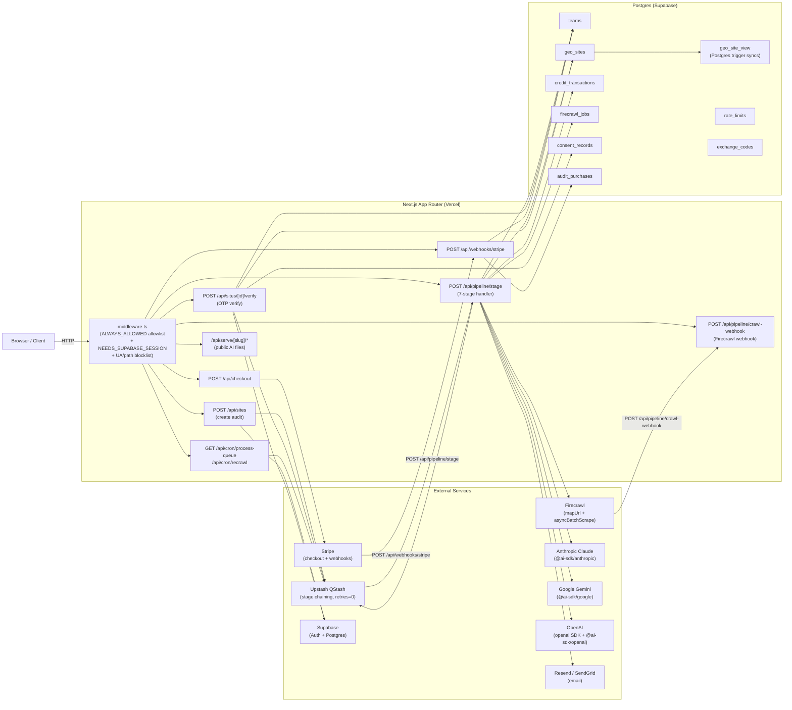

# GEO Audit Platform — Architecture

> Last verified against code: 2026-06-09 (branch `fix/audit-incremental-on-main`)

---

## Stack & Runtime

| Layer | Technology |
|-------|-----------|
| Framework | Next.js 16 (App Router), deployed on Vercel Fluid Compute |
| ORM / DB | Drizzle ORM + `postgres` driver (not `@neondatabase/serverless`) against Supabase Postgres |
| Auth | Supabase (`@supabase/ssr` v0.8) — Email OTP + Google OAuth; all browser auth proxied through `/api/auth/proxy/[...path]` to bypass ISP blocks |
| Async pipeline | Upstash QStash (`@upstash/qstash` v2) — stages chained via `enqueueStage()` in `lib/qstash.ts` |
| Crawler | Firecrawl only (`@mendable/firecrawl-js` v4) — `mapUrl` for discovery, `asyncBatchScrapeUrls` for crawl |
| Payments | Stripe SDK v20 — subscriptions + one-time credits + $10 GMC audit purchase |
| LLM providers | Vercel AI SDK (`ai` v6, `@ai-sdk/anthropic`, `@ai-sdk/google`, `@ai-sdk/openai`); raw `openai` v6 SDK; `@anthropic-ai/sdk` v0.78; `@google/generative-ai` v0.24 |
| Email | Resend (`resend` v6) + SendGrid (`@sendgrid/mail` v8) |
| PDF | Puppeteer-core + `@sparticuz/chromium-min` |
| Tests | Vitest 4 via `Dockerfile.test` (node:24-alpine); Playwright 1.58 for E2E |

### Key environment variables

| Variable | Purpose |
|----------|---------|
| `DATABASE_URL` | Supabase pooler (port 6543, PgBouncer) |
| `QSTASH_TOKEN` | QStash publish key |
| `QSTASH_CURRENT_SIGNING_KEY` / `QSTASH_NEXT_SIGNING_KEY` | Stage handler auth |
| `FIRECRAWL_API_KEY` | Crawler |
| `STRIPE_SECRET_KEY` / `STRIPE_WEBHOOK_SECRET` | Payments |
| `SUPABASE_SERVICE_ROLE_KEY` | Admin user provisioning |
| `CRON_SECRET` | Cron + local pipeline auth (>= 32 chars required) |
| `LLM_LOCAL` / `LLM_BASE_URL` / `LLM_LOCAL_MODEL` | Local LLM routing override |

---

## Component Diagram



---

## The 7-Stage Pipeline

All stages are handled in `app/api/pipeline/stage/route.ts`. Authentication is via QStash `upstash-signature` header or `Authorization: Bearer <CRON_SECRET>` for cron/dev. The handler always returns HTTP 200 — failures are written to DB. QStash is configured with `retries: 0`.

Function `maxDuration` is 800 s (Vercel Fluid Compute Pro ceiling). Internal `STAGE_TIMEOUT_MS` is 785 s, leaving 15 s for `markFailed` before Vercel's hard kill.

### Stage sequence

```
discover → crawl-fanout → [poll-chunk × N] → merge-crawl
                                                    |
                               +--------------------+
                          extract-trees        research   (parallel)
                               +--------------------+
                                                    |
                                                 analyze → [generate-chunk × 6, parallel]
                                                                 |
                                                             assemble
                                                                 |
                                             (GMC only) audit-purchase-finalize
```

### Per-stage detail

| Stage | `pipelineStatus` written | What it does | Chains to |
|-------|--------------------------|--------------|-----------|
| **discover** | `discovery` | `discoverSite()` → Firecrawl `mapUrl`. URL prioritization via `detectArchitecture` + `prioritizeUrls`. Snapshots prior run. **Requires `maxPages` on payload** (BUG-001/FIX-007 — never falls back to `FREE_MAX_PAGES`). | `crawl-fanout` |
| **crawl-fanout** | `crawling` | Splits URLs into chunks via `computeChunks()`. Calls Firecrawl `asyncBatchScrapeUrls` per chunk. Inserts `firecrawl_jobs` rows. Sets webhook + poll-chunk safety net. Fails if < 50% chunks submitted (`CRAWL_FANOUT_MIN_SUBMIT_RATIO = 0.5`). | `poll-chunk` × N (+ Firecrawl webhook) |
| **poll-chunk** | _(crawling)_ | Checks Firecrawl job status. Re-enqueues with 15 s delay if not done. 20-min circuit breaker per chunk. On completion: atomic `fanInChunk` (increment `crawlChunksDone` + append pages). When `done === total`: inlines `merge-crawl`. Idempotency: skips if `firecrawlJobs.status = "completed"` (webhook already processed). | Inlines `merge-crawl` on fan-in |
| **merge-crawl** | _(crawling)_ | Flattens chunk results, deduplicates pages, filters on-domain, runs `scoreCrawlQuality`. Retry-failed runs merge new pages with prior `crawlData`. Resets `pre_analyze_done = 0`. FIX-030 (2026-06-09): deduplicates `crawlFailedUrls` against recovered URLs (was causing "URL shows as both succeeded and failed" in dashboard). | `extract-trees` + `research` in parallel |
| **extract-trees** | `extracting` | LLM extraction of `geoTree` + `categoryTree` + mapping. 3-attempt internal chain: Sonnet (temp=0) → Sonnet (temp=0.3) → OpenAI. Stage timeout: 785 s. **Not stage-retried** (internal chain handles transient failures). Fan-in counter: when `pre_analyze_done` reaches 2, enqueues analyze. | Fan-in → `analyze` |
| **research** | `researching` | `gatherCompetitiveIntel()` → competitive context. Graceful-degrades on failure (non-fatal). Fan-in counter: when `pre_analyze_done` reaches 2, enqueues analyze. | Fan-in → `analyze` |
| **analyze** | `analyzing` | `analyzeGeoGaps()` → Claude API 8-pillar GEO scorecard. Passes `geoTree`. Establishes `baselineScorecard` on first run. Inlines `generate-fanout`. | Inlines `generate-fanout` |
| **generate-fanout** | `generating` | Fans out 6 `generate-chunk` messages: `llms`, `business`, `schema-sitewide`, `schema-faq`, `schema-article`, `page-fixes`. Sets `generateChunksTotal = 6`, `generateChunksDone = 0`. | `generate-chunk` × 6 |
| **generate-chunk** | _(generating)_ | Each generates one asset type. Schema sub-chunks use `fanInSchemaChunk` (atomic append + increment). `llms` and `business` use `fanInGenerateChunk`. Uses `withRetry` for validation — throws `RetryValidationExhausted` on final failure (ES-082). Last chunk triggers assemble. | `assemble` on fan-in |
| **assemble** | `assembling` → `complete` | `assembleResults()` → Claude executive summary. Computes `projectedScore`. Per-page vulnerability extraction. Credit reconciliation (bulk + single): refunds unused in transaction, logs over-consumption. Writes `pipelineStatus: "complete"`. Sends completion email. Idempotency guard: early-return if already `"complete"` (NEW-L-01). | `audit-purchase-finalize` (GMC only) |
| **audit-purchase-finalize** | _(complete)_ | GMC $10 only. Competitor discovery + 120-query citation check (both via internal HTTP with `purchaseToken`). Renders PDF. CAS-writes `pdfDeliveredAt` before email. Scrubs `magicLink` only after email success. | — |

### `maxPages` budget contract (BUG-001 / FIX-007)

`StagePayload` in `lib/qstash.ts` is a discriminated union. The `discover` variant **requires** `maxPages: number` at compile time. Runtime resolution via `resolveDiscoverBudget()`:
1. Trust explicit positive `payload.maxPages`.
2. Fall back to `site.crawlLimit` (DB column).
3. **Throw** — never silently fall back to `FREE_MAX_PAGES`.

This closes the "Pro-20-pages" bug class.

### Stage retry policy

Retryable (up to 2 retries, 30 s / 60 s backoff): `research`, `analyze`, `generate-chunk`, `assemble`.

Non-retryable: `discover`, `crawl-fanout`, `poll-chunk`, `merge-crawl`, `extract-trees` (internal 3-attempt chain), `generate-fanout` (duplicate fan-out risk if retried).

### Cron safety-net

`app/api/cron/process-queue/route.ts` — scheduled. Detects sites stuck in any in-progress status. Re-enqueues the correct stage via `STATUS_TO_STAGE`:

| `pipelineStatus` | Re-enqueued stage |
|-----------------|-------------------|
| `discovery` | `discover` |
| `crawling` | `crawl-fanout` |
| `extracting` | `extract-trees` |
| `researching` | `research` |
| `analyzing` | `analyze` |
| `generating` | `generate-fanout` |
| `assembling` | `assemble` |

Batch limit: 100 sites per tick (oldest-first). Also restarts `pending` sites whose initial enqueue never landed.

`app/api/cron/recrawl/route.ts` — triggers scheduled re-audits for sites with `nextCrawlAt` in the past, frequency clamped to `isFrequencyAllowedForTier`.

---

## Data Model

Key tables in `lib/db/schema.ts`. All type columns use Drizzle's `.$type<>()` for compile-time domain enforcement (FIX-018).

### `teams`
| Column | Type | Notes |
|--------|------|-------|
| `id` | text PK | nanoid |
| `ownerUserId` | text | Supabase auth.users UUID |
| `creditBalance` | integer | Authoritative under credit-pool model |
| `subscriptionTier` | `SubscriptionTier` | `'free'|'starter'|'growth'|'pro'` |
| `subscriptionStatus` | `SubscriptionStatus` | `'active'|'past_due'|'canceled'|'inactive'` |
| `billingModel` | `BillingModel` | `'free'|'page_allowance'|'credit_pool'` — discriminator (FIX-018 / FIND-TYPEDESIGN-001) |
| `monthlyPageAllowance` | integer | 0 in credit-pool model |
| `monthlyPagesUsed` | integer | Reset by `invoice.paid` webhook each cycle |
| `stripeCustomerId` / `stripeSubscriptionId` | text | Stripe links |
| `currentPeriodEnd` | timestamp | Set from Stripe invoice period |

### `geo_sites`
Pipeline working table. **Never read for rendering** — use `geo_site_view`.

Key columns: `pipelineStatus` (`PipelineStatus` closed union), `crawlLimit`, `creditsReserved`, `crawlChunksTotal/Done/Results`, `generateChunksTotal/Done`, `preAnalyzeDone` (fan-in counter), `batchId` (bulk batch), `currentRunNumber` / `currentRunKind` (in-place rerun), `ownerEmailCanonical` (indexed — free-audit-limit enforcement via canonical email, NEW-A-02), `tokenExpiresAt` NOT NULL (90-day default).

### `geo_site_view`
Read-optimized, written by a Postgres trigger on every pipeline stage write. Dashboard and results page read ONLY this table.

### `credit_transactions`
Append-only ledger. `type` column uses closed `CreditTxnType` union. Every credit in/out writes `balanceBefore` / `balanceAfter` / `creditsChanged`.

### `firecrawl_jobs`
One row per 500-URL chunk per audit. Status: `pending → scraping → completed | failed`. Used for crawl-webhook idempotency and circuit-breaker URL recovery.

### `audit_purchases`
GMC $10 one-time purchase records. `magicLink` stored temporarily, scrubbed after successful delivery email. `pdfDeliveredAt` is the CAS idempotency gate for the finalize stage.

### `exchange_codes`
DB-backed one-time-use codes (32-char nanoid) for cross-domain auth handoff. CAS-guarded redeem; `redeemedAt` set atomically.

### `rate_limits`
DB-persisted rate limit counters (key, count, resetAt). Replaces in-memory Maps that reset on Vercel cold starts.

---

## Billing Model

```
creditBalance = tier.credits × billing-interval months
monthlyPageAllowance = 0  (credit-pool: all audits draw from creditBalance)
```

`tierEntitlementColumns()` in `app/api/webhooks/stripe/route.ts` is the **canonical entitlement writer** — used by signup, authenticated upgrade, invoice renewal, and subscription.updated. It SETs (never increments) `creditBalance`, preventing webhook redelivery credit stacking. This overwrites any OAuth signup bonus on first subscription (BUG-007 fix).

Tier table (`lib/config.ts`):

| Tier | Monthly price | Credits/month | maxAuditPages | Sites |
|------|--------------|---------------|---------------|-------|
| free | $0 | 0 | 20 | 1 |
| starter | $99 | 1,500 | 100 | 5 |
| growth | $249 | 7,500 | 500 | 10 |
| pro | $499 | 30,000 | null (uncapped) | 20 |

`TIER_SELLABLE` is the single source of truth for purchasable `(tier, interval)` pairs: starter/growth on monthly+quarterly; pro on monthly+annual.

Page budget resolution: `lib/services/page-accounting.ts:resolveFirstAuditMaxPages()`. Active subscriber with allowance headroom → `min(remaining, tier.maxAuditPages)`. Credit-pool → `min(creditBalance × 10, tier cap)`. Neither → denied (402). Per-audit cap is now tier-specific (FIX-008 / 2026-06-09 audit), not the flat `PAID_MAX_PAGES = 100`.

---

## LLM Layer

All OpenAI-compatible calls route through `lib/llm/openai-route.ts`:
- `openAILikeBaseUrl()` — defaults to `https://api.openai.com/v1`; override with `LLM_BASE_URL`
- `resolveOpenAIModel(defaultModel)` — returns `LLM_LOCAL_MODEL` (default `google/gemma-4-12b`) when `LLM_LOCAL=1` or `LLM_BASE_URL` is set
- `openAIApiKey()` — falls back to `"local"` for LM Studio

Anthropic-native calls use `@ai-sdk/anthropic` directly. Google Gemini uses `@ai-sdk/google` directly. The OpenAI fallback in `extract-trees` uses the raw `openai` SDK via this routing layer.

---

## Security Posture

### Middleware allowlist (`middleware.ts`)
Every request goes through Next.js Edge middleware. Routes not in `ALWAYS_ALLOWED` receive 403. Routes in `NEEDS_SUPABASE_SESSION` run `updateSession()` which strips client-supplied identity headers (`x-user-email`, `x-user-id`) and re-stamps them from the verified Supabase cookie session (C1 anti-spoofing fix, 2026-05-27 audit).

Other middleware defenses:
- Blocked UA patterns (nikto, sqlmap, ahrefsbot, semrushbot, etc.)
- Blocked path patterns (wp-admin, .env, .git, .php, etc.)
- CSP header (Report-Only) with nonce-based `strict-dynamic`
- Security headers: `X-Frame-Options: DENY`, HSTS 2 years, `X-Content-Type-Options`, etc.

### RLS + REVOKE
RLS is enabled on Supabase tables. New Drizzle migrations must explicitly add `REVOKE SELECT ON <table> FROM anon` (recurring gotcha: Drizzle-created tables default to RLS-off).

### Rate limiting
All limits are DB-persisted in `rate_limits`:
- Site creation: 10 req / 60 s per IP
- OTP brute-force: `otpAttempts` + `otpLockedUntil` on `geo_sites`; OTP gate has timing equalization (HP-240/244)
- Re-audit: 10 / hr per team

### Stripe webhook
- Signature verified via `stripe.webhooks.constructEvent()` before any processing
- Idempotency guard on every event type (session.id dedup marker in `credit_transactions`)
- HMAC binding on `websiteUrl` metadata (`lib/checkout-binding.ts`) verified at webhook time (H4, 2026-05-27)

### `accessToken` / `tokenExpiresAt`
`geoSites.tokenExpiresAt` is NOT NULL with a 90-day default (ES-090). Results and downloads gate on this expiry. `rotateIfExpired()` uses an atomic conditional UPDATE to prevent double-rotation race conditions (HP-236).
