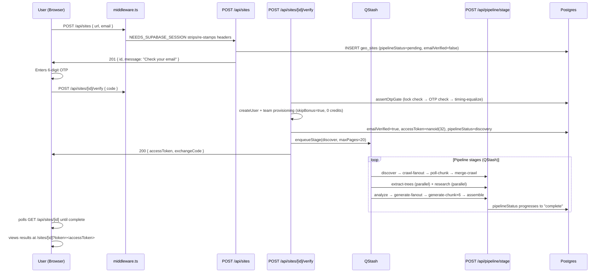
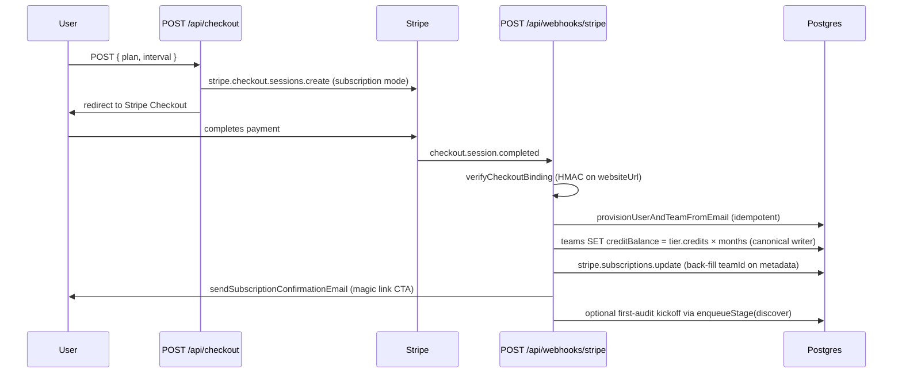

# GEO Audit Platform — Customer Journey

> Code-grounded walkthrough of every stage a customer passes through.
> Verified against codebase on 2026-06-09 (branch `fix/audit-incremental-on-main`).

---

## Free-Audit → Results Happy Path



---

## Subscription Activation Path



---

## Stage 1 — Landing / Submit Domain + Email

**Customer does:** Enters domain URL + email on the homepage form. Optionally uploads a CSV for bulk audit.

**Route handler:** `POST /api/sites` (`app/api/sites/route.ts`)

**What's written to DB:**
- `geo_sites` row inserted: `domain`, `ownerEmail`, `ownerEmailCanonical` (Gmail dot/plus stripped via `canonicalizeEmail()`), `emailVerified=false`, `verificationCode` (SHA-256 of 6-digit code), `codeExpiresAt` (15 min), `pipelineStatus="pending"`.
- `accessToken` is NOT stamped yet (only after OTP verify succeeds).

**Gates and limits:**
- **IP rate limit:** 10 req / 60 s per IP (`sites_create:<ip>`) — checked AFTER body validation so malformed-body 400s don't consume the bucket.
- **Free audit limit:** For non-Pro users, `FREE_AUDIT_LIMIT = 2` distinct domains per canonical email (`ownerEmailCanonical` indexed equality scan, NEW-A-02). Gmail `user+alias@gmail.com` and `u.s.e.r@gmail.com` collapse to the same canonical. Exceeding this returns 402 `{ upgradeRequired: true }`.
- **Pro fast-path:** If the request carries a valid Supabase session (`x-user-email` matches, team has credits or active subscription), OTP is skipped: pipeline starts immediately, `accessToken` stamped now, `skipVerify: true` returned.
- **Bulk audit:** URL count 1–500 (`BULK_MAX_URLS`). Must have a `teams` record (Pro required). If authenticated Pro, debits credits immediately and starts pipeline without OTP. If not authenticated, sends OTP.
- **SSRF protection:** Private IP ranges blocked (`127.x`, `10.x`, `192.168.x`, `169.254.x`, etc.).
- **Cached results:** If another user already has a `complete` audit for the same domain, the new row is pre-populated with those results (no pipeline needed). Still gated by `FREE_AUDIT_LIMIT`.

---

## Stage 2 — OTP Verify

**Customer does:** Submits the 6-digit OTP received by email.

**Route handler:** `POST /api/sites/[id]/verify` (`app/api/sites/[id]/verify/route.ts`)

**What's written to DB:**
- `geo_sites`: `emailVerified=true`, `verificationCode=null`, `accessToken=nanoid(32)`, `tokenExpiresAt` (+90 days), `pipelineStatus="discovery"`.
- `teams` + `team_members` + `team_domains`: provisioned via `ensureTeamForUser(userId, email, { skipBonus: true })`. Free OTP users get **0 credits** — no signup bonus.
- `credit_transactions`: `single_crawl_reserve` ledger row if credits are reserved (paid path).
- `consent_records`: if `tosAccepted=true` included in body.

**Budget resolution (post-2026-06-09 audit):**
`resolveFirstAuditMaxPages()` in `lib/services/page-accounting.ts` — the canonical resolver shared across all entry points:
- Active subscriber with monthly allowance headroom → `min(remaining, tier.maxAuditPages)` [starter=100, growth=500, pro=uncapped]
- Credit-pool (active tier + credits) → `min(creditBalance × 10, tier cap)`; capped at `ABSOLUTE_MAX_PAGES=500` for Pro
- Free tier / 0 credits → `FREE_MAX_PAGES = 20` (never denied for free users — they still get 20 pages)

Budget is now **per-tier**, not capped at 100 for all paid users. This is a significant behavior change from the pre-audit code which used the flat `PAID_MAX_PAGES=100`.

**Gates:**
- OTP brute-force: `assertOtpGate()` — read-only lock check first (`checkOtpLock`), then pending OTP check, then expiry check, then code match (`verifyCode`). Increment (`incrementOtpAttempt`) only on actual wrong-code attempt. Timing-equalized with a no-op UPDATE to prevent latency-based enumeration (HP-237/239/240).
- Re-login path (site already verified): same `assertOtpGate` before any mutation. Generates a new exchange code for session handoff.
- Concurrent reserve race: `gte`-guarded UPDATE on `teams.creditBalance` — if 0 rows affected, another concurrent debit won; returns 402.

**Bulk verify:**
Looks up all sibling sites in the same `batchId`. Drains credit balance in sequence across sites (batch-level `BULK_FREE_PAGES=10` floor, not per-site). All sites set `pipelineStatus="crawling"`, credits reserved. Enqueues `crawl-fanout` for each (not `discover` — bulk skips discovery).

---

## Stage 3 — Pipeline Run

**Customer does:** Waits while the pipeline runs (~5–20 min depending on site size).

**Route handler:** `POST /api/pipeline/stage` (`app/api/pipeline/stage/route.ts`) — invoked repeatedly by QStash.

**Full stage sequence:** See [Architecture doc](./ARCHITECTURE.md#the-7-stage-pipeline).

**DB writes per stage:**
- Each stage updates `geo_sites.pipelineStatus` to the in-progress status for that stage.
- `geo_site_view` is updated by a Postgres trigger on every `geo_sites` write — the dashboard polls this table.
- Crawl data lands in `geo_sites.crawlData` (JSONB).
- LLM outputs land in `geo_sites.geoScorecard`, `generatedLlmsTxt`, `generatedBusinessJson`, `generatedSchemaBlocks`, `perPageFixes`, etc.
- On `assemble` completion: `pipelineStatus="complete"`, `lastCrawlAt`, `nextCrawlAt` (+7 days).

**Credit reservation and reconciliation:**
Credits are reserved at verify time (not at enqueue). At `assemble` completion, `bulkCreditsRequired(actualPagesCrawled)` is compared to `creditsReserved`:
- Under-consumption → refund the difference (atomic transaction clearing `creditsReserved=null`).
- Over-consumption → loud `credit_reconciliation_mismatch` log alert (no auto-debit — not idempotent across retries).
- NEW-L-01 idempotency: `creditsReserved=null` is the idempotency marker — a cron-triggered second assemble invocation reads null and skips reconciliation entirely.

**QStash idempotency (ES-B10):**
`enqueueStage` can include `runNumber` matching `geo_sites.currentRunNumber`. Stage handler drops stale messages (`payloadRunNumber !== currentRunNumber`) with 200 `{ dropped: "stale_run" }`. Orphaned runs are detected by the cron safety-net, not re-enqueued at drop time.

**Failure handling:**
- `markFailed()` sets `pipelineStatus="failed"`, clears `crawlJobIds`, refunds `creditsReserved`.
- For GMC audit purchases: CAS-guarded transition to `refund_pending`, issues Stripe refund, sends customer email.
- Retryable stages: `research`, `analyze`, `generate-chunk`, `assemble` (up to 2 retries).

---

## Stage 4 — Results / Dashboard

**Customer does:** Views their GEO audit results at `/sites/[id]`.

**Route handlers:** `GET /api/sites/[id]` (reads `geo_site_view`). Dashboard at `/dashboard` reads team's sites.

**Auth gates:**
- `accessToken` in `sessionStorage` (stamped at verify) passed as `?token=<accessToken>` or `Authorization` header.
- `tokenExpiresAt` checked server-side — NULL or past expiry = 403. Token is 90 days from issue.
- Supabase session (cookie) grants dashboard access without `accessToken`.
- `geo_site_view.teamId` is the data isolation boundary — teams only see their own sites.

**Read path:**
Dashboard and results page read **only** from `geo_site_view` — never from `geo_sites` directly. `geo_site_view` is kept in sync by a Postgres trigger on every pipeline stage write.

---

## Stage 5 — Upgrade / Checkout

**Customer does:** Clicks upgrade in `UpgradeModal` (dashboard or results page) or the pricing page.

**Route handler:** `POST /api/checkout` (`app/api/checkout/route.ts`)

**Two modes:**
1. **Credit top-up** (one-time): `quantity` 1–50 packs × `CREDITS_PER_PACK = 100` credits. Creates Stripe Checkout session in `payment` mode with `creditPacks` and `teamId`/`userId` in metadata.
2. **Subscription** (recurring): Creates session in `subscription` mode. `plan` + `interval` + `teamId` + `websiteUrl` in metadata. HMAC binding on `websiteUrl` + `priceId` stamped as `checkout_binding` metadata key.

**`TIER_SELLABLE` (`lib/config.ts`)** is the single source of truth:
- starter/growth: monthly + quarterly
- pro: monthly + annual (no quarterly)

Subscription signup (unauthenticated, `/api/subscription-signup/checkout`) creates a session without a `teamId` — account is provisioned at webhook time.

---

## Stage 6 — Subscription Activation (Stripe Webhook)

**Customer does:** Completes Stripe checkout.

**Route handler:** `POST /api/webhooks/stripe` (`app/api/webhooks/stripe/route.ts`)

**Event: `checkout.session.completed` (subscription)**

Three paths depending on `session.metadata.type`:

### Path A: `subscription_signup` (unauthenticated new subscriber)
1. Idempotency guard: short-circuit if `teams.stripeSubscriptionId` already matches OR `credit_transactions` dedup marker exists (NEW-W-06).
2. Reconcile-don't-clobber (NEW-A-01): if the resolved team already has an ACTIVE different subscription, alert ops and skip — never clobber.
3. `provisionUserAndTeamFromEmail()` — idempotent Supabase user + team creation, generates magic link.
4. `teams SET` via canonical `tierEntitlementColumns(tier, billingIntervalMonths(interval))`:
   - `creditBalance = tier.credits × months` (SET, not incremented)
   - `monthlyPageAllowance = 0`
   - `monthlyPagesUsed = 0`
   - `subscriptionTier`, `subscriptionStatus = "active"`, `stripeCustomerId`, `stripeSubscriptionId`
5. Back-fills `teamId` onto the Stripe subscription metadata (so renewals can key on it).
6. Sends confirmation email with magic link CTA.
7. Auto-kicks off first audit via `enqueueStage(discover, maxPages=budget.maxPages)` if `websiteUrl` binding validates.

### Path B: authenticated upgrade (existing `teamId` in metadata)
1. Idempotency: skip if `teams.stripeSubscriptionId` already equals the new subscription id.
2. `teams SET` via `tierEntitlementColumns(tier)` — same canonical writer.

### Path C: one-time credit top-up
1. `creditTransactions` dedup: skip if session.id already processed.
2. Verifies `userId` is still a team member.
3. `teams SET creditBalance += creditsAdded` (atomic SQL expression).
4. Inserts `credit_transactions` topup row.

**DB writes:**
- `teams`: `creditBalance`, `subscriptionTier`, `subscriptionStatus`, `stripeCustomerId`, `stripeSubscriptionId`, `monthlyPageAllowance`, `monthlyPagesUsed`, `currentPeriodEnd`.
- `credit_transactions`: ledger row for topup / subscription marker.

---

## Stage 7 — Renewal / Cancellation / Past Due

**Event: `invoice.paid`** (subscription cycle or create)

Handler reads team via `invoice.parent.subscription_details.metadata.teamId` (Stripe SDK v20 path — the pre-v20 path was a silent regression). Refreshes credit pool via canonical writer:
```
teams SET creditBalance = tier.credits × monthsFromInvoicePeriod(period)
         monthlyPagesUsed = 0
         currentPeriodEnd = period.end
```
`monthsFromInvoicePeriod` computes billing months from invoice period start/end timestamps (NEW-W-05 — replaces incorrect +31-day offset).

**Event: `invoice.payment_failed`**

Sets `teams.subscriptionStatus = "past_due"`. Falls back to DB lookup by `stripeSubscriptionId` when `teamId` is missing from metadata (FIX-004). Sends `sendPaymentFailedEmail` with Stripe customer portal link. Alerts ops if no team can be resolved.

**Event: `customer.subscription.deleted`**

Sets `teams.subscriptionStatus = "canceled"`. No credit clawback — credits persist until consumed.

When a team's `subscriptionStatus` is `"past_due"` or `"canceled"`, `resolveFirstAuditMaxPages()` treats them as credit-only (not active subscriber), so the subscription headroom branch is bypassed and only remaining credits fund new audits.

---

## Stage 8 — Re-audit, Retry-Failed, and Recrawl Cron

### Re-audit (manual)

**Route:** `POST /api/sites` with an existing `domain`+`email` combination where `pipelineStatus="complete"`.

**Pro session fast-path (ES-wave-2 B3):**
- Requires: Supabase session (`x-user-email` matches, JWT user-id verified as team member).
- Rate-limited: 10 re-audits / hr per team (`re_audit_team:<teamId>`).
- Budget resolved via `resolveFirstAuditMaxPages()` — credits are reserved in a `gte`-guarded transaction (FIX-014 race prevention).
- Rotates `accessToken` + `tokenExpiresAt`. Audit log entry written to `re_audit_actions` (`mechanism = "pro_session"`).
- Enqueues `discover` with the resolved budget.

**OTP fallback:** If session fails AC-B3 checks, falls through to OTP send (no 401/403 — preserves legitimate recovery).

**Re-audit route (`/api/sites/[id]/regenerate`):** Separate route for dashboard-initiated re-run; uses same `resolveFirstAuditMaxPages()` resolver.

### Retry-failed (bulk)

**Route:** `POST /api/sites/[id]/retry-failed`

For bulk audits with `pipelineStatus="failed"`. Re-runs only the previously-failed URL subset (`retrySubsetUrls`). `currentRunKind="retry-failed"` causes `merge-crawl` to merge new pages with prior successful `crawlData` rather than replace it. `autoDiscoverBrandPages` is skipped on retry-failed runs.

### Recrawl cron

**Route:** `GET /api/cron/recrawl`

Queries `geo_sites` where `nextCrawlAt < now` and `crawlFrequency != "manual"`. Frequency clamped to `isFrequencyAllowedForTier` — a downgrade on the team's tier silently clamps their scheduled frequency. Enqueues `discover` for each eligible site with the resolved budget.

### Process-queue cron (safety-net)

**Route:** `GET /api/cron/process-queue`

Detects and rescues stuck in-progress sites. Re-enqueues the correct stage. Also restarts `pending` sites with verified email whose initial enqueue was lost. Budget for `discover` re-enqueue: `site.crawlLimit` first, then `resolveFirstAuditMaxPages()`, then `FREE_MAX_PAGES` as last resort.

---

## Notable Behavior Changes (2026-06-09 Audit)

| Area | Old behavior | New behavior |
|------|-------------|--------------|
| Page budget | Flat `PAID_MAX_PAGES=100` for all paid users | Per-tier: starter 100, growth 500, Pro uncapped (bounded by `ABSOLUTE_MAX_PAGES=500`) via `resolveFirstAuditMaxPages()` |
| Pro-20-pages bug | `maxPages` was optional on `StagePayload`; missing budget silently used `FREE_MAX_PAGES` | `StagePayload` discriminated union makes `maxPages` **required** on `discover`; missing budget throws |
| Free-audit-limit | Counted by `ownerEmail` (bypassable with Gmail aliases) | Counted by `ownerEmailCanonical` (indexed column, dot/plus aliases collapsed) |
| Credit reconciliation over-consumption | Silent ledger divergence | Loud `credit_reconciliation_mismatch` alert — no auto-debit |
| `crawlFailedUrls` dedup | Not deduped — URL could appear as both succeeded and failed | Deduplicated against recovered URL set in `merge-crawl` (FIX-030) |
| Billing entitlement writer | Multiple divergent paths (page-allowance vs credit-pool) | Single `tierEntitlementColumns()` canonical writer on all Stripe paths (FIX-001) |
